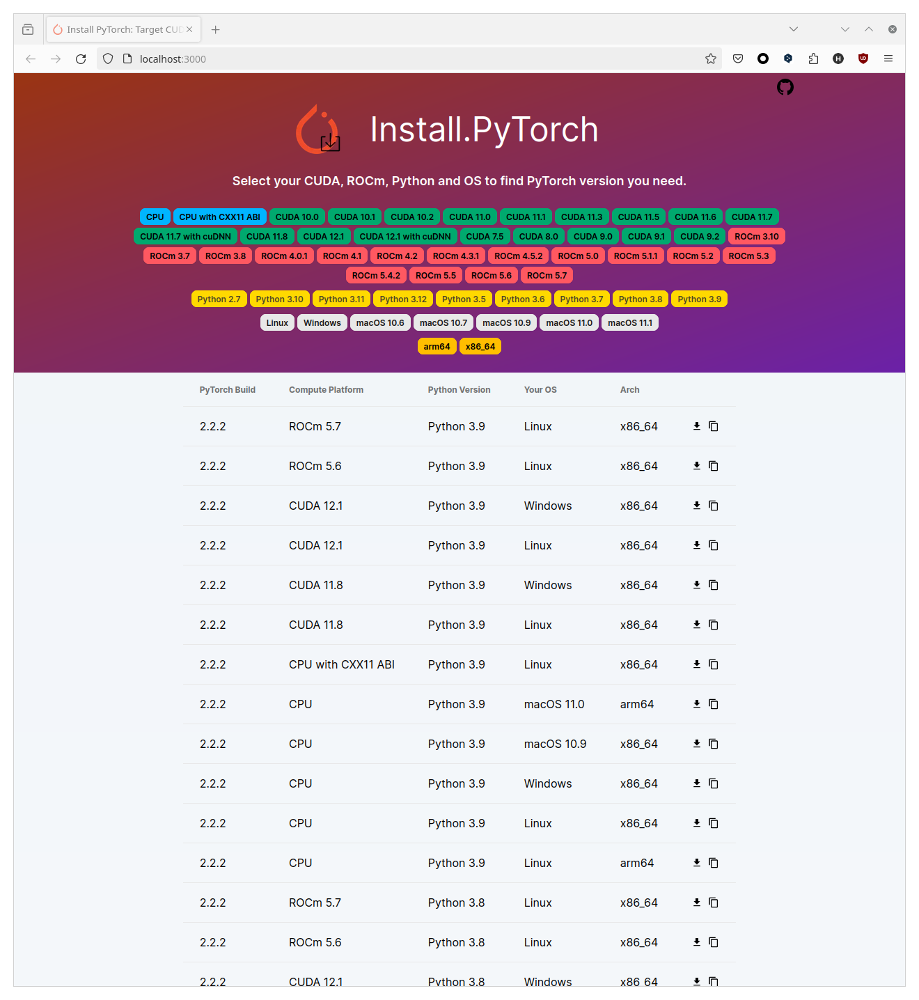

# Install.PyTorch

https://install.pytorch.site

You know, it's difficult to find a specific version of PyTorch that works with your CUDA or ROCm version, your Python version, and your OS.

Install.PyTorch is designed to help you find the right version of Pytorch :D.

